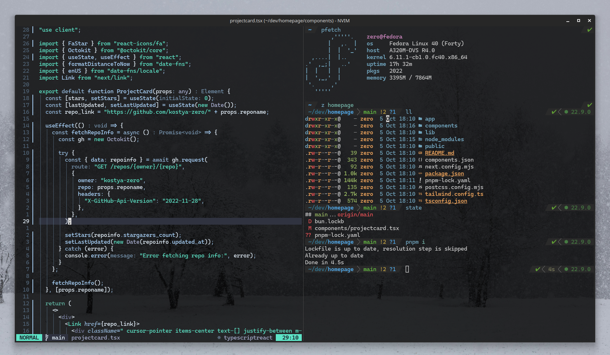

# Zero's Dotfiles

> [!IMPORTANT]
> Don't blindly use my dotfiles if you don't know how they work. Use them at your own risk!

## Programs

- [NeoVim](https://github.com/neovim/neovim)
- [Fish Shell](https://github.com/fish-shell/fish-shell)
- [WezTerm](https://github.com/wez/wezterm)
- [lazygit](https://github.com/jesseduffield/lazygit)
- [bat](https://github.com/sharkdp/bat)
- [fd](https://github.com/sharkdp/fd)
- [eza](https://github.com/eza-community/eza)

## Setup

### NeoVim

- Neovim >= **0.9.0** (needs to be built with **LuaJIT**)
- Git >= **2.19.0** (for partial clones support)
- a [Nerd Font](https://www.nerdfonts.com/)(v3.0 or greater) **_(optional, but needed to display some icons)_**
- [lazygit](https://github.com/jesseduffield/lazygit) **_(optional)_**
- a **C** compiler for `nvim-treesitter`. See [here](https://github.com/nvim-treesitter/nvim-treesitter#requirements)
- for [telescope.nvim](https://github.com/nvim-telescope/telescope.nvim) **_(optional)_**
  - **live grep**: [ripgrep](https://github.com/BurntSushi/ripgrep)
  - **find files**: [fd](https://github.com/sharkdp/fd)
- a terminal that support true color and _undercurl_:
  - [kitty](https://github.com/kovidgoyal/kitty) **_(Linux & Macos)_**
  - [wezterm](https://github.com/wez/wezterm) **_(Linux, Macos & Windows)_**
  - [alacritty](https://github.com/alacritty/alacritty) **_(Linux, Macos & Windows)_**
  - [iterm2](https://iterm2.com/) **_(Macos)_**

### Shell

- [Fish Shell](https://github.com/fish-shell/fish-shell)
- [fisher](https://github.com/jorgebucaran/fisher) - plugin manager for fish
- [Tide Prompt Theme](https://github.com/IlanCosman/tide)
- [z for fish](https://github.com/jethrokuan/z)
- [nvm.fish](https://github.com/jorgebucaran/nvm.fish) - node version manager for fish
- [gitnow](https://github.com/joseluisq/gitnow)
- [fzf.fish](https://github.com/PatrickF1/fzf.fish)

## About me

- [My Website](https://kostyazero.com)
